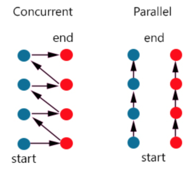

# Parallel vs Concurrent Computing

## Parallel Computing
Parallel computing is when multiple processors or cores work on different parts of a single task at the same time. This approach divides the task into smaller sub-tasks, which are executed simultaneously, aiming to speed up the overall computation.

### Example:
Now, imagine you have three friends over, and each of you takes on one of the chores:
- **Washing Dishes**: One friend starts washing the dishes.
- **Homework**: Another friend starts doing your homework.
- **Feeding Pet**: You start feeding your pet.

Everyone is working on their own task at the same time. So, all three chores are being done simultaneously, and they get finished much faster because no one has to stop one task to start another.

### Key Point:
Parallel Computing: Like you and your friends each doing a different chore at the same time. All the tasks are being worked on simultaneously.
This way, everything gets done quicker because multiple tasks are being handled at the exact same time, rather than switching back and forth between them.

## Concurrent Computing
Concurrent computing involves managing multiple tasks and progressing by switching between them, which can occur on a single processor or multiple processors.

### Example:
Imagine you are the only one at home, and you have three chores to do: wash the dishes, do your homework, and feed your pet.
- **Washing Dishes**: You start washing the dishes.
- **Homework**: After washing a few dishes, you realize you need to let them dry for a bit, so you start doing some of your homework while the dishes dry.
- **Feeding Pet**: While doing homework, you remember that your pet is hungry, so you take a break to feed your pet.

You keep switching between these chores. You’re not doing all of them at the same time, but you are making progress on each one by switching from one to the other.

### Key Point:
Concurrent Computing: Like you taking turns doing different chores. You're not doing them all at once, but you’re making sure they all get done by switching between them.
This way, you can handle multiple things by giving each a bit of your time and attention until they’re all done.
